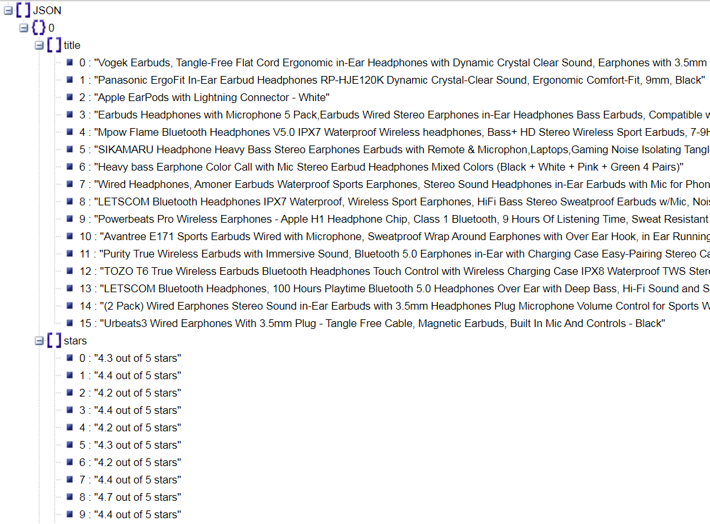
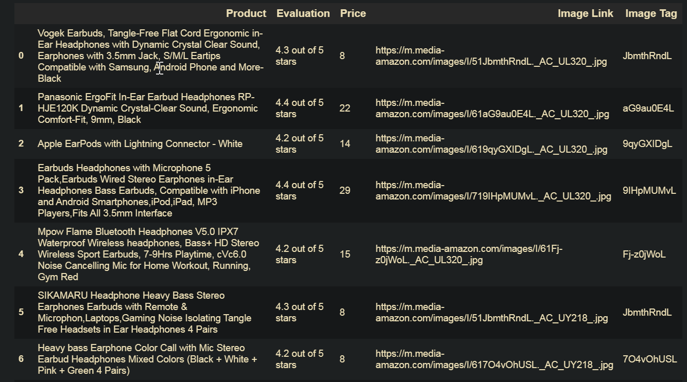

# Scraping Amazon.com using web page search function


---

## About spider name

All the spiders I use in Scrapy have names related to real spiders. The name of the spider used in this project is taken from the genus `nephila`. These spiders weave impresive webs. You can check more at https://en.wikipedia.org/wiki/Nephila


> Nephila pilipes eating a cicada.

---

## Table of Contents

- [Description](#description)
- [Technologies](#technologies)
- [Installation](#installation)
- [Sample Output](#sample-ouput)
- [Tasks](#tasks)
- [Comments and Suggestions](#comment)
- [Contact](#contact)

---

### Description

This is a simple scraper for extracting products details from "Amazon.com" when specified in the search page.

---

### Fields

These are the fields the scraper is going to fetch:

- Title
- Stars
- Price
- Image Link
- Image Name

---

### Technologies

- Python
- Scrapy
- PyCharm

---

### Installation

This project uses different packages that need to be installed in PyCharm. In order to do that go to the menu bar and go to:

`file->settings->Project:[project_name]->Python Interpreter`

 and then press the `+` button at the right side to open the package installation and management window. In the search window search for the packages mentioned below and click Install Package (you will need and internet connection):

 - Scrapy
 - Urllib3

  Amazon could ban the computer visiting its web site. If it is the case, to bypass those restrictions we are going to use an USER_AGENT allowed by Amazon to be used by Google. 

  In order to get it we go to https://www.whatismybrowser.com/detect/what-is-my-user-agent and copy the User Agent shown in the web site. In the project folder we open `settings.py` and under the commented code for user agent we paste
  `USER_AGENT = 'Mozilla/5.0 (Windows NT 10.0; Win64; x64) AppleWebKit/537.36 (KHTML, like Gecko) Chrome/84.0.4147.135 Safari/537.36'`

---

### Using the scrapper

1. In the method `start_requests` in the file nephila.py change value in variable `search_text` to search for a new item.
2. In PyCharm terminal run command `scrapy crawl nephila crawler -o items.json` to save the data as JSON File.
3. To check everything is okay type in the terminal `scrapy check nephila`.

---

### Sample Output



> Data saved as JSON file.

---



> Dataframe as shown in Jupyter notebook.
---

### Tasks

- [x] Extract product details from Amazon.com
- [x] Save data as a JSON format.
- [x] Use of Regular Expresions to extract portions of data.
- [x] Use of a `try` block to handle errors if item searched is not found.
- [x] Use of `contracts` to unit test the spider and check if something is broken.

---

### Comments and Suggestions

- The code `l.add_css('imgname', '.s-image::attr(src)', re=r'\b\d[0-9]([^\.]*)')` in `parse_item` method utilizes a regular expresion to extract a portion of the image url. However it may not be necessary to use a regex at all. It was done for illustrative purposes.

- Ideally instead of using only a variable to search for an item in a web page we could use a list of items to be searched stored as a `csv` file. The code below could be implemeted to get that functionality:

```python
    def start_requests(self):
      """Method to read searched items from items file"""
      items = csv.DictReader(open(os.path.join(os.path.dirname(__file__),"./searched_items.csv")))

      for item in items:
          search_text = item["item"]
          url = "https://www.amazon.com/s?k={0}&ref=nb_sb_noss_2".format(search_text)
          yield scrapy.Request(url, callback=self.parse_item, meta={"search_text": search_text})
```

- Usually there will be several pages related to the searched item. It should be implemented a horizontal crawling.

### Contact

You can contact me via `Whatsapp` or `Telegram` with phone number `+5352688092`
